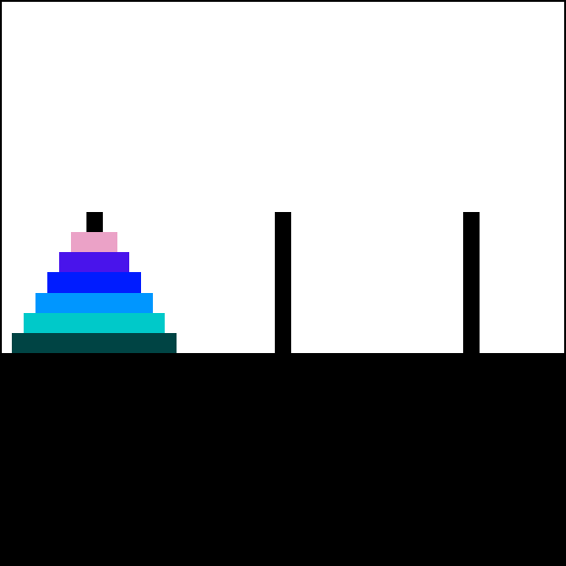

# Towers of Hanoi
Coded by [Salvador Octavio Briones Martínez](https://github.com/sbriones97) and [Gustavo Adolfo Rueda Enríquez](https://github.com/GustavoRuedaEnriquez).

Implementation of the algorithm to solve the _Towers of Hanoi_ puzzle, originally coded in C language and adapted to its equivalent in MIPS assembly.

    

